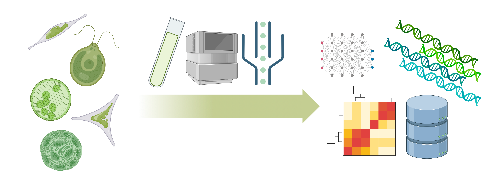
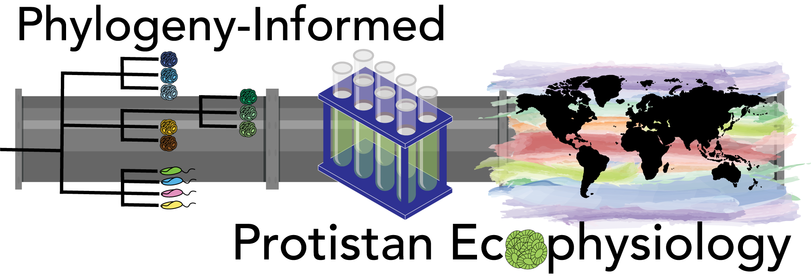
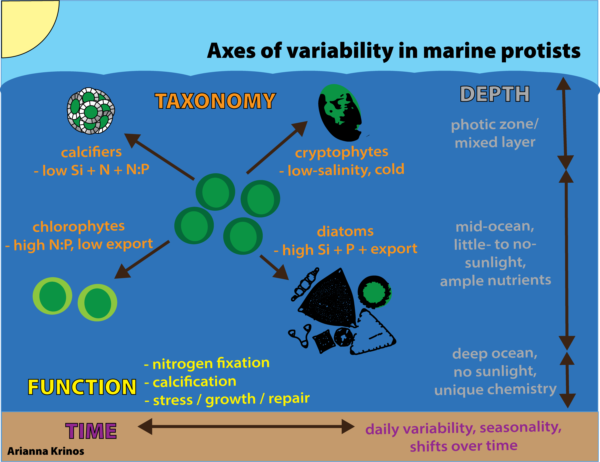
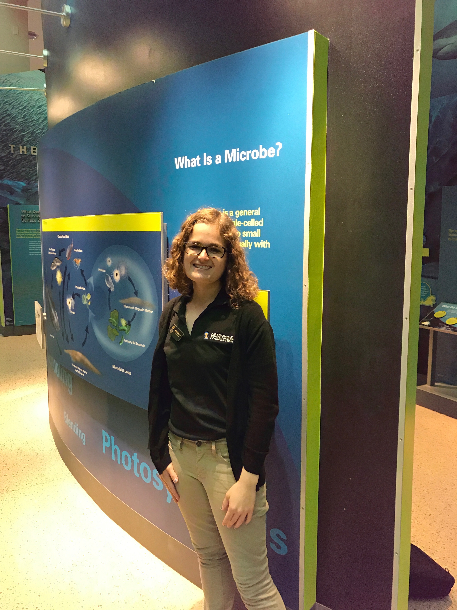

Arianna Krinos is a microbiologist, a computational scientist, an educator, and a postdoctoral researcher at MIT. She received her PhD from the MIT-WHOI Joint Program in Oceanography and Applied Ocean Science and Engineering in 2024. Arianna's PhD was jointly advised by Dr. Harriet Alexander at Woods Hole Oceanographic Institution (WHOI) and Dr. Michael (Mick) Follows at the Massachusetts Institute of Technology (MIT). 

 

  

Arianna is deeply invested in pedagogy training and educational outreach. Arianna served as a Teaching Development Fellow (2023-2024) with the MIT Teaching & Learning Lab and as a leader of the WHOI Broader Impacts Group.

### Microbial community ecology & physiology

Arianna considers herself a protistan ecologist and a computational scientist. What does this mean? Arianna's goal is to understand the role of eukaryotic phytoplankton (and other protists) in ecosystems, and how these roles and microbial physiology affect cycling of nutrients and other resources.

 

  

Arianna is interested in the *taxonomy* axis of diversity. How is diversity increasing or decreasing in response to environmental change? Does decreasing or increasing diversity change the overall health of the ecosystem? Strain diversity in individual species and its context within aquatic microbial communities has driven several of Arianna's recent research directions. Arianna is particularly interested in phylogeny and genetic diversity to the extent that it determines the responsiveness of microbial physiological traits to environmental change.

### Computational science

In order to assess and catalog population and community diversity in microbial communities, Arianna uses a combination of experimental culture techniques and field sampling, bioinformatics and molecular methods, and ecosystem modeling. In diverse microbial communities, high-throughput computational approaches are needed to census and compare community members. To this end, Arianna is actively involved in *protistan taxonomic annotation software development*, the development of *new metatranscriptome analysis techniques to evaluate microbial activity* _in situ_, and comparative assessment of observed population genetic diversity and theoretical predictions from models.

 

  

Arianna is a certified Software Carpentries instructor, and is excited about pursuing diverse teaching opportunities, especially those that involve math and computation. She always learns a lot from the teaching process! Arianna pursued a Teaching Development Fellow with the MIT Teaching & Learning Lab in order to foster teaching and pedagogy access in the MIT-WHOI Joint Program.

Previously, Arianna graduated from Virginia Tech with degrees in Biological Sciences, Computer Science, and Computational Modeling and Data Analytics (minor in Mathematics). During her time at Virginia Tech, she was a coach in the Virginia Tech Writing Center, the Editor-in-Chief of and a writer for _Engineers' Forum_, one of the country's last remaining student-led engineering magazines, and an avid exhibitor for local K-12 programs, including Kindergarten 2 College and the Virginia Tech Science Festival. She spent a semester as a mentor for pre-kindergarten students in the Head Start program in local Giles County while taking a course on pedagogical practices for pre-kindergarten students in rural communities.

  

### Broader interests

When not in the classroom or lab, Arianna enjoys scrapbooking, yoga, swimming, and visiting her families in Florida, New Jersey, and Virginia, including her four younger siblings.