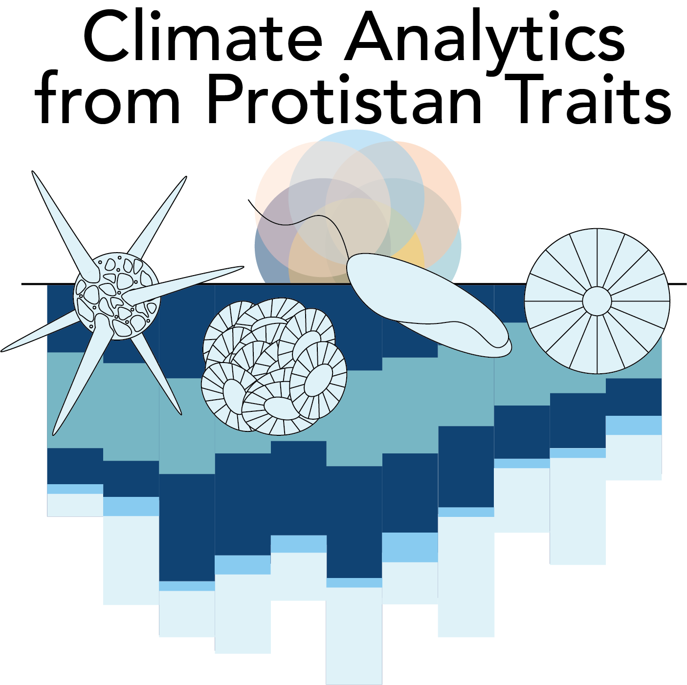

Arianna Krinos Quinn is a microbial ecologist, a computational scientist, an educator, and a postdoctoral researcher at Brown with the [Center for Chemical Currencies of a Microbial Planet](https://ccomp-stc.org/). She received her PhD from the MIT-WHOI Joint Program in Oceanography and Applied Ocean Science and Engineering in 2024. Arianna's PhD was jointly advised by Dr. Harriet Alexander at Woods Hole Oceanographic Institution (WHOI) and Dr. Michael (Mick) Follows at the Massachusetts Institute of Technology (MIT). Arianna's research centers on how to leverage molecular datasets to identify protistan traits that can be useful to climate-relevant models. She is excited about including undergraduates in research projects and designing undergraduate courses that include programming and creative, data-driven inquiry.

 

  

Arianna is deeply invested in pedagogy training and educational outreach. Arianna served as a Teaching Development Fellow (2023-2024) with the MIT Teaching & Learning Lab and as a leader of the WHOI Broader Impacts Group.

### Ecoevolutionary traits of marine protists

Arianna's research focuses on understanding the role of eukaryotic phytoplankton (and other protists) in ecosystems, and how these roles affect cycling of nutrients and other resources and hence can be scaled up to e.g., climate modeling approaches. Arianna is interested in **intraspecific diversity** and **interactions** in protists as climate-relevant indicators and harbingers of future protistan response to environmental change. Specifically, Arianna is currently studying the ecoevolutionary implications of strain diversity in the coccolithophore _Gephyrocapsa huxleyi_, and how chemical currencies affect interactions between major phytoplankton taxa and hence community succession and bloom formation.

 

  

Arianna is particularly interested in phylogeny and genetic diversity to the extent that it determines the responsiveness of protistan traits to environmental change.

### Computational science

In order to assess effects of shifts in protistan communities, Arianna uses a combination of experimental culture techniques and field sampling, bioinformatics and molecular methods, and biogeochemical, ecological, and physiological modeling. In diverse microbial communities, high-throughput computational approaches are needed to census and compare community members. To this end, Arianna is actively involved in _protistan taxonomic annotation software development_, the development of _new metatranscriptome analysis techniques to evaluate microbial activity_ _in situ_, and comparative assessment of observed population genetic diversity and theoretical predictions from models. Arianna's goal is distilling traits relevant for model parameterization from complex genetic and physiological datasets.

Arianna graduated from Virginia Tech with degrees in Biological Sciences, Computer Science, and Computational Modeling and Data Analytics (minor in Mathematics). Arianna was previously a coach in the Virginia Tech Writing Center, the Editor-in-Chief of and a writer for _Engineers' Forum_, one of the country's last remaining student-led engineering magazines, and an avid exhibitor for local K-12 programs, including Kindergarten 2 College and the Virginia Tech Science Festival. She spent a semester as a mentor for pre-kindergarten students in the Head Start program in local Giles County while taking a course on pedagogical practices for pre-kindergarten students in rural communities.

### Broader interests

When not in the classroom or lab, Arianna enjoys scrapbooking, yoga, swimming, and visiting her families in Florida, New Jersey, and Virginia, including her four younger siblings.
