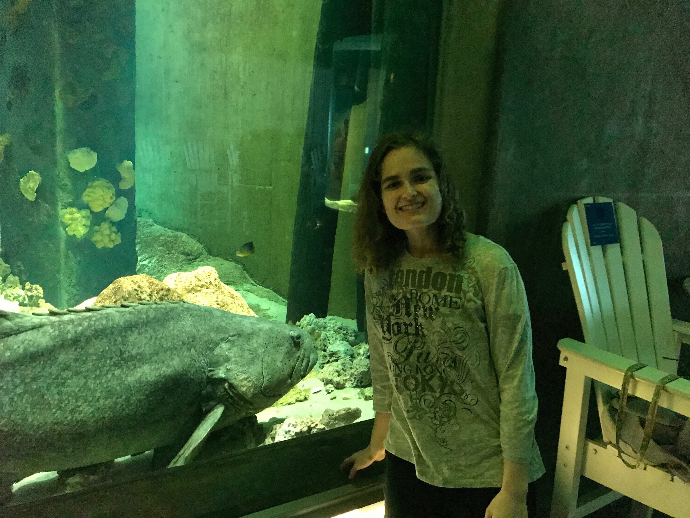

Arianna Krinos is a Ph.D. Candidate in Biological Oceanography in the MIT-WHOI Joint Program in Oceanography and Applied Ocean Science and Engineering. Arianna is jointly advised by Dr. Harriet Alexander at Woods Hole Oceanographic Institution (WHOI) and Dr. Michael (Mick) Follows at the Massachusetts Institute of Technology (MIT). 

 

  

Arianna is interested in phytoplankton ecology, specifically protistan diversity in the oceans, particularly in coastal environments. In order to assess and catalog population and community diversity in these communities, Arianna uses a combination of experimental culture techniques and field sampling, bioinformatics and molecular methods, and ecosystem modeling. Arianna is a certified Software Carpentries instructor, and is excited about pursuing diverse teaching opportunities, especially those that involve math and computation. She always learns a lot from the teaching process!

Arianna graduated from Virginia Tech with degrees in Biological Sciences, Computer Science, and Computational Modeling and Data Analytics (minor in Mathematics) in 2019. During her time at Virginia Tech, she was a coach in the Virginia Tech Writing Center, the Editor-in-Chief of and a writer for _Engineers' Forum_, one of the country's last remaining student-led engineering magazines, and an avid exhibitor for local K-12 programs, including Kindergarten 2 College and the Virginia Tech Science Festival. She spent a semester as a mentor for pre-kindergarten students in the Head Start program in local Giles County while taking a course on pedagogical practices for pre-kindergarten students in rural communities.

  

When not in the classroom or lab, Arianna enjoys scrapbooking, yoga, swimming, and visiting her families in Florida and New Jersey, including her four younger siblings and her two nephews.