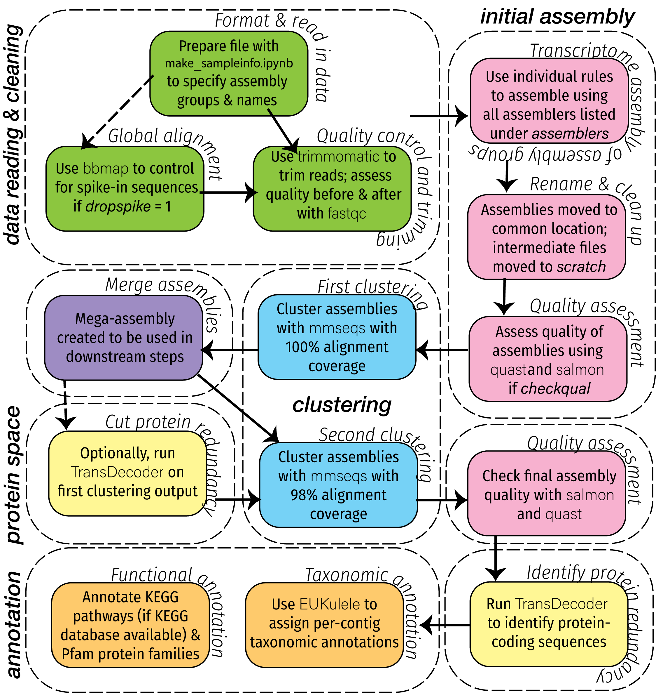
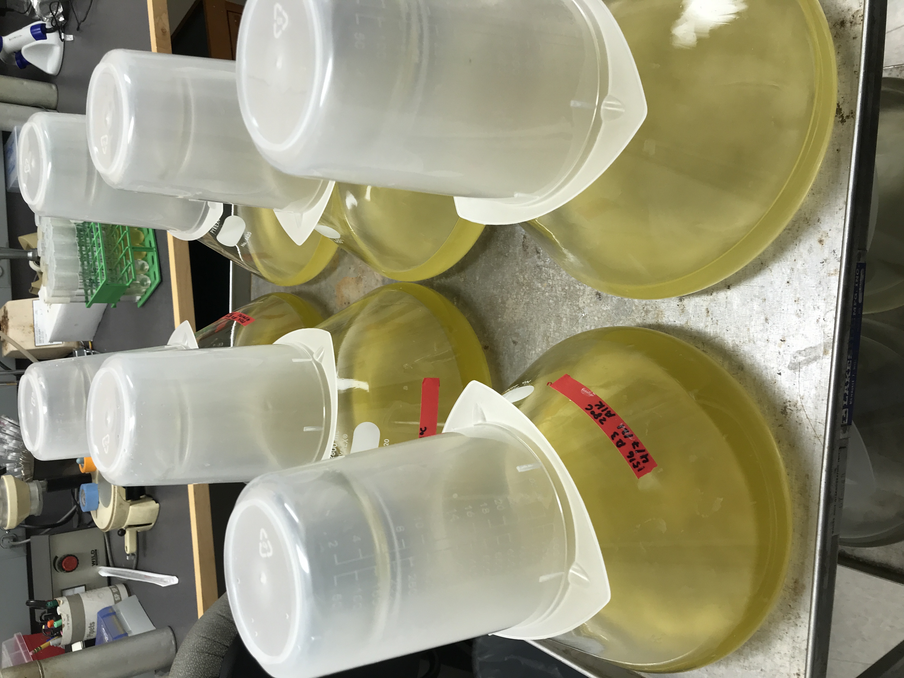

## Eukrhythmic: metatranscriptome assembly for marine eukaryotes

  

The field of omics has quickly exploded into one of the most popular routes of biological inference. And this is for good reason: omics studies are *powerful*, and, increasingly, they are fast and cheap. However, the development of omics tools tends to be biased, in particular for microbes. The momentum is lost as the technology rapidly changes, and the front line of researchers quickly moves on to the latest and greatest. For this reason, bacteria get a disproportionate amount of attention as technologies develop, and tools for genomes are much more abundance than tools for transcriptomes. 

But *metatranscriptomics*, or the measurement of the expression levels of an entire community from a single sample, has an important role to play in microbial oceanography. We often can *only get* a single sample easily, and there's an enormous amount of uncultured diversity present in those samples. For that reason, marine metatranscriptomics have massive potential both to tell us about organisms that we aren't able to cultivate in the lab, and to tell us how the *expression* of various genes changes over time. This simultaneously tells us what microbes are present in a sample, and what biogeochemical roles they might be performing. 

I am interested in marine microbial eukaryotes, or protists, which present the secondary challenge that a lot of omics tools are not developed for eukaryotic organisms. For this reason, I have developed *euk*`rhythmic`, a metatranscriptomic pipeline that consolidates the output of multiple individual assemblers to produce a cohesive assembly process that can be used for downstream analysis and posing meaningful biological and oceanographic questions.

### A presentation on `eukrhythmic` from WHOI Biology Department Seminar, 2021

<iframe width="853" height="480" src="https://www.youtube.com/embed/Ww0iWvUqs-8" title="YouTube video player" frameborder="0" allow="accelerometer; autoplay; clipboard-write; encrypted-media; gyroscope; picture-in-picture" allowfullscreen></iframe>

## Exploring the basis for thermal acclimation in _Emiliania huxleyi_

_Emiliania huxleyi_ is a globally-important coccolithophore, or calcifying phytoplankton species, in the haptophyte group. With a complex "pan-genome" identified and described for this commonly-studied lab alga, it provides the perfect test bed for exploring capacity for thermal acclimation in marine phytoplankton. To this end, I am combining laboratory experiments with 'omics-based understanding and models to decode the factors that make thermal acclimation possible in laboratory strains of this species, and to use this understanding to inform prediction of species ranges in the ocean in the future.

  

This project involves ongoing long-term culture experiments as well as sequencing prior to and following the dynamic process of thermal acclimation. In all, I will grow and measure >12 strains of _Emiliania huxleyi_ in the lab by the time the project concludes.

## Probing the ecological community of Lake Mendota using time series metagenomics

