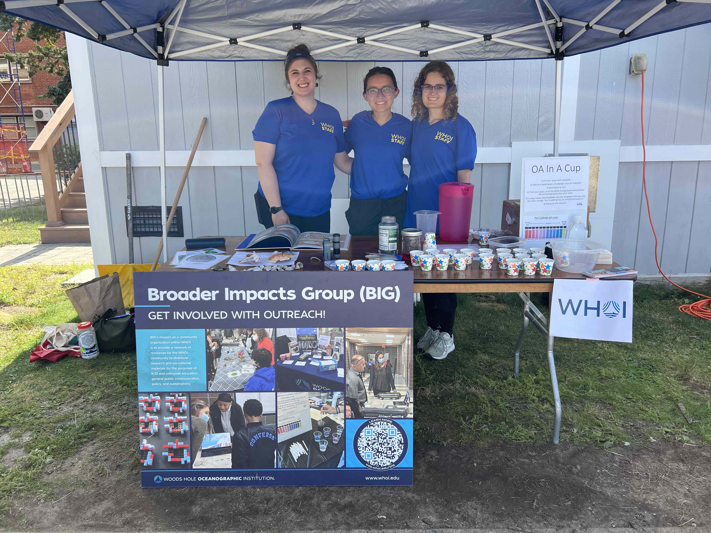
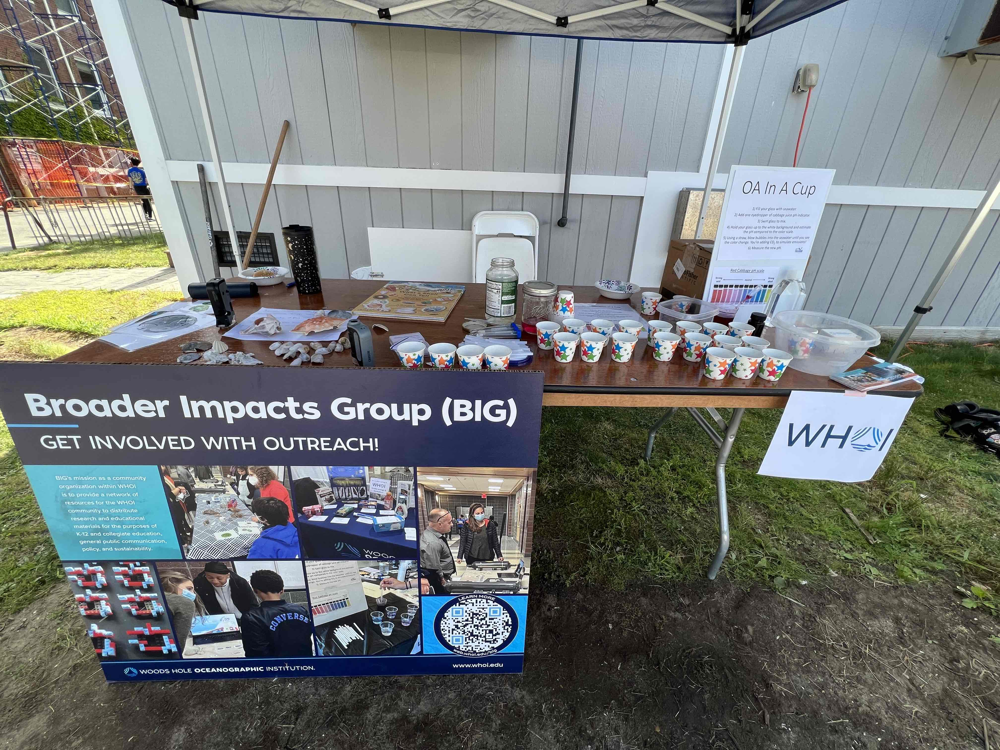
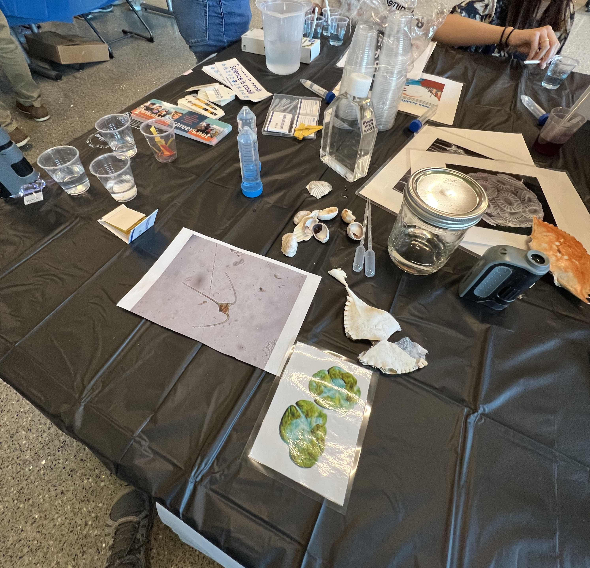
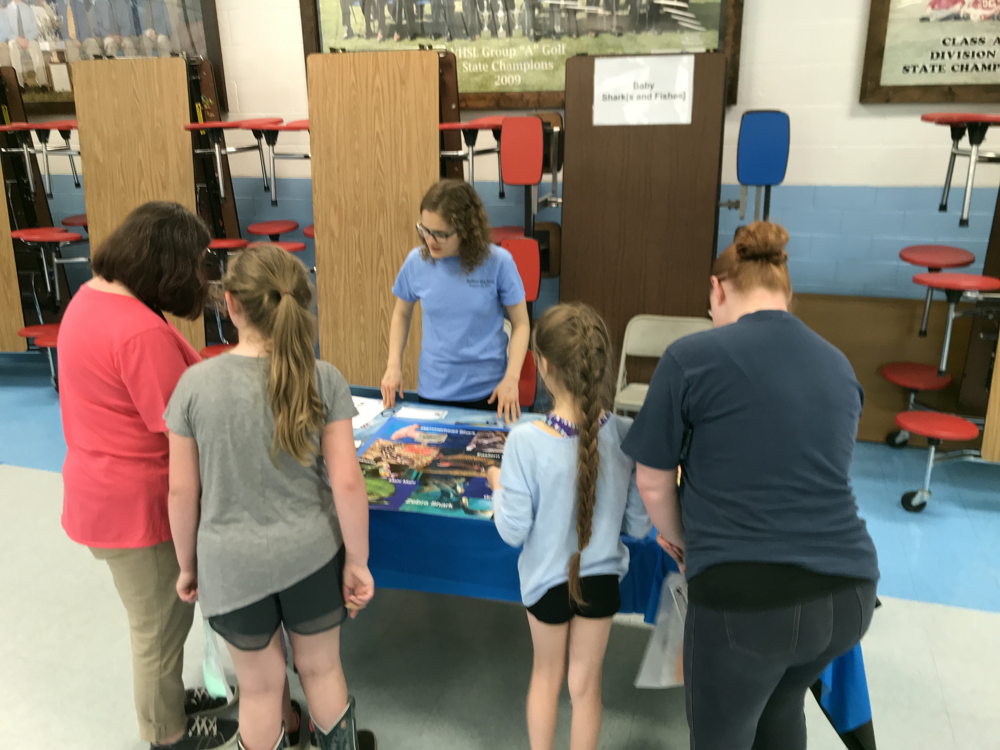
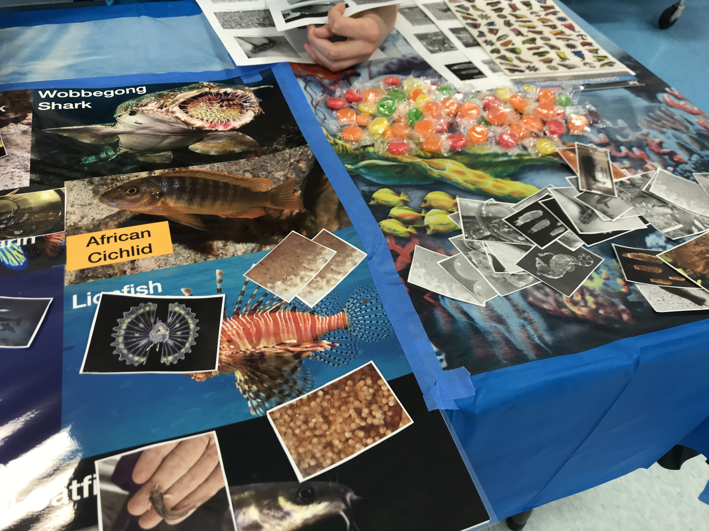

## Philosophy on teaching

Arianna believes teaching to be **equally important** to scholarly research. Developing learning materials, mentoring students, and participating in outreach is **critical to improving access to education in diverse populations**. Arianna's experiences with teaching have both informed and redirected her research pursuits. Arianna has teaching interests in data science, computational science, physiology, and ecology and environmental science, in particular aquatic ecology.

Computational science suffers from below-average diversity because of a lack of effective teaching and outreach (Lang et al. 2016). Arianna is committed to creating inclusive learning experiences that illustrate the power of computing approaches across disciplines.

### Summer 2023 Woods Hole Science Stroll

Approximately **1,800 visitors** were counted strolling on the dock at WHOI this year for the annual Woods Hole Science Stroll event, the first since before the pandemic! We were so glad to be able to represent the efforts of the Broader Impacts Group (BIG) at this year's event.

  

  

### Summer 2023 Summer Math Review

Arianna taught a short course in `R` programming as part of WHOI's annual Summer Math Review. Exercises from the course can be accessed [here](https://github.com/akrinos/2023-math-review-R).

### Spring 2023 STEAM night

We traveled out to Wareham to reach hundreds of K-12 students at a STEAM night in May!

  

### Fall 2022 outreach experiences

Fall 2022 outreach experiences included representing WHOI at Junior Achievement's [career fair](https://twitter.com/WHOI/status/1606032077954113542), at Keith Middle School's fall [Science Nights of Wonder](https://www.linkedin.com/posts/woods-hole-oceanographic-institution_inspiration-whoi-mitabrwhoi-activity-7011797797599367168-L6Eb?utm_source=share&utm_medium=member_desktop), and in K-12 classrooms. Thanks to so many awesome people for putting these opportunities together for us to share what we do and why we love aquatic ecology and several other ocean disciplines!

  

### Course design: phytoplankton physiology & ecology

Arianna designed a course in Fall 2021 on Phytoplankton Physiology & Ecology. Some of the materials for the seminar are maintained [here](https://2021-phyto-phys.readthedocs.io/en/latest/index.html). Arianna co-taught the course in Fall 2021 (with her advisor Mick Follows).

### Teaching Assistant for MIT 7.470: Biological Oceanography

Arianna was the TA for the Spring 2022 offering of biological oceanography, which is the first-year required course for the MIT-WHOI Joint Program in Biological Oceanography. As part of this role, she prepared recitation presentations and exam reviews, and helped students learn field skills on a one-day oceanographic day trip on the R/V Tioga.

  

### Software Carpentries

Arianna was certified with Software Carpentries in August 2020, and since has taught the following workshops:

- R and the Shell, November 2020, *co-instructor*
- Python and the Shell, June 2021, [*co-instructor*](https://alexanderlabwhoi.github.io/2021-06-14-whoipython/)

In addition, Arianna has been a helper at the following workshops:

- R and the Shell, June 2023, *helper*
- Python and the Shell, June 2020, *helper*
- R and the Shell, June 2020, *helper*
- Data Science, October 2020, [*helper*](https://k-rns.github.io/2020-10-26-WHOI-Data/)

### Falmouth Summer Academy

In Summer 2021, Arianna taught a course about the intersection between math and environmental science to a group of 11 elementary and middle school-age children. Arianna had a fantastic time learning more about science communication, and how to market math to a group of naturalists...and to entice mathematicians to care about important word problems!

  

  

### Marine Biological Laboratory Physiology Course Bioinformatics Bootcamp

Arianna assisted the class as a TA, including developing and teaching course materials on [transcriptomics](https://github.com/MBL-Physiology-Bioinformatics/2021-Bioinformatics-Tutorial-Materials/tree/master/transcriptomics).

### Summer 2021 HSSP: Modeling Demographic Dynamics in Human Populations

Arianna co-taught a 3-week course on Demographic Modeling (including human and bacterial populations) in Summer 2021, many of the students being of high-school age.

### Summer 2021 Educational Studies Program: Ocean Phytoplankton and Coccolithophores

In August 2021, Arianna gave a lecture about ocean phytoplankton and biogeochemistry to a classroom of 75+ high school students...on a Saturday!

### Summer 2020 HSSP: Bayesian Statistics & Biological Applications

In Summer 2020, Arianna co-taught a 6-week course on Bayesian statistics to a group of nearly 40 students, mainly of high school age. This class included Bayesian statistics basics and specific applications to biology. Part of this was a use case for coronavirus research, because this course overlapped with the early- to mid-stages of the COVID-19 pandemic. One specific example was how likely it was that a person had been infected with COVID-19, given that they had tested positive for antibodies.

We also talked about mark-recapture and other ecological applications of Bayesian analysis. See below for the slides from our second session of the course!

[Sample course slides here!](https://drive.google.com/file/d/1XVsslU1polX_9KtjiNeR2sX1R_F0zO5s/view?usp=sharing)

[Short blog post here](https://mitesp.home.blog/2020/07/29/dipping-my-toes-into-online-learning/)

  

### Spark!, Spring 2020

Arianna taught a 90-minute lecture on _Emiliania huxleyi_ and their viruses to a virtual classroom of high school students in Spring 2020 as part of the Spark! curriculum offered by MIT's Educational Studies Program (ESP).

### Kindergarten-2-College Presenter/Educator, Virginia Tech

Hosted short courses on the intersection of science and writing/journalism as Editor-in-Chief of student-run engineering magazine *Engineers' Forum*. 

  

### Presenter at Local Science and Engineering Education Events, Virginia Tech & MIT

Examples include developing presentation and educational resources for stream ecology booths, heading up a science-writing intersection booth with *Engineers' Forum*, and creating an activity on the juvenile vs. adult phase of sharks and fishes themed off of popular children's song "Baby Shark".

Examples include: 
- Giles County STEM Fair
- Virginia Tech Science Festival (4 years)
- Price House Environmental Science Fair (VT SEEDS)
- Girls' Day at the MIT Museum
- John Carlson Lecture, MIT (at New England Aquarium)

  

  

### Virginia Tech Science Festival

Arianna designed and led activities about the importance of writing and communication in science & engineering as editor-in-chief of student-led magazine _Engineers' Forum_

  

  

  

  

Arianna's designs for educational materials on local streams for an exhibit led by members of the Virginia Tech Stream Team.

  

  

### Peer Educator/Instructor, Honors Reading Seminar (Spring 2016) 

Led a course in which we read and discussed three books pertaining to the impacts of media on "Generation Z", in particular the rise of networks like Nickelodeon. 

### Peer Educator/Instructor, Honors First-Year Seminar (Fall 2016)

Taught a class of first-year undergraduates in the Honors program, in particular about strategies for success in college, obtaining research and other experiences as an undergraduate, and making ample use of the Honors program and scholarship resources. 

### Peer Educator/Instructor, Honors Reading Seminar (Spring 2017)

Led a reading-based course on climate change and the Anthropocene. Included developing course materials, leading discussions, and inviting guest speakers.

### Ambassador, General Engineering (2015-2017)

Arianna mentored current first-year and prospective first-year students in the General Engineering program, and represented the department at recruiting events.

### Ambassador, Department of Computer Science (2018-2019)

Arianna helped mentor current and prospective undergraduates in Computer Science and represented the department at recruiting events. 

### Teaching Assistant, Biology Orientation Seminar (Fall 2017)

Arianna was a teaching assistant for first-year course in Biological Sciences, including advising and mentoring students and grading assignments.

## Ongoing activities during graduate school

### Broader Impacts Group: Teaching and Presentations in Camps & Schools

As part of WHOI's Broader Impacts Group, Arianna provides occasional teaching and outreach support to local Massachusetts-area schools. Below is a recorded presentation from a virtual outreach opportunity.

#### References

Lang, C., Craig, A., & Egan, M. (2016). The importance of outreach programs to unblock the pipeline and broaden diversity in ICT education. International Journal of Information and Communication Technology Education (IJICTE), 12(1), 38-49.

